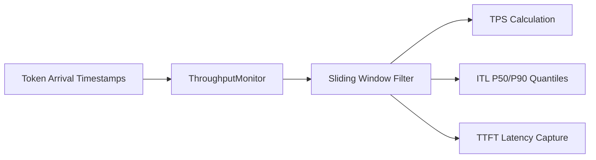

# genpark-sliding-window-moving-throughput-monitor-skill

Sliding window performance monitor computing generation velocity (TPS), Time-To-First-Token (TTFT), and Inter-Token Latency (ITL) distributions.

## Architecture

## Features
- **High-Resolution Telemetry**: Sub-millisecond latency distribution calculations.
- **Percentile Distributions**: Evaluates P50 and P90 tail latencies.
- **Standard Library Only**: 100% Python stdlib.
